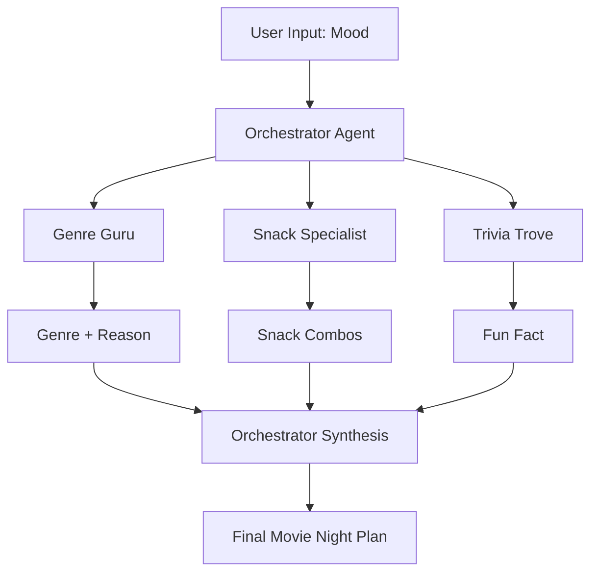

# Movie Night AI 🎬

A sophisticated multi-agent AI system that creates personalized movie night plans based on your current mood. Using Azure AI Agents, this system orchestrates multiple specialized AI agents to deliver genre recommendations, snack pairings, and fun movie trivia.

## 🌟 Features

- **Multi-Agent Architecture**: Utilizes 4 specialized AI agents working in coordination
- **Mood-Based Recommendations**: Analyzes user mood to suggest perfect movie genres
- **Smart Snack Pairing**: Recommends food and drink combinations that complement the chosen genre
- **Movie Trivia**: Provides engaging fun facts related to the selected genre
- **Flexible Output Parsing**: Supports both JSON and natural language response formats
- **Robust Fallback System**: Built-in sample movie database for reliable recommendations
- **Ephemeral Agents**: Automatically cleans up created agents after each session

## 🏗️ Architecture

### Agent Ecosystem

The system consists of four specialized agents:

1. **Genre Guru** (`genre_agent`)
   - Analyzes user mood and suggests optimal movie genre
   - Provides reasoning for genre selection
   - Supports genres: Comedy, Adventure, Sci-Fi, Horror, Romance, Drama, Animated, Action-Comedy

2. **Snack Specialist** (`snack_agent`)
   - Recommends 2 snack and drink combinations
   - Tailors suggestions based on selected genre
   - Keeps recommendations concise (≤6 words each)

3. **Trivia Trove** (`funfact_agent`)
   - Provides genre-related fun facts
   - Delivers bite-sized trivia (≤25 words)
   - Enhances the movie night experience

4. **Movie Night Orchestrator** (`orchestrator`)
   - Coordinates all other agents
   - Processes user input and manages workflow
   - Formats final output in user-friendly format

## 🚀 Quick Start

### Prerequisites

- Python 3.8 or higher
- Azure subscription with AI Services enabled
- Azure AI Agents service access

### Installation

1. **Clone the repository**
   ```bash
   git clone <your-repo-url>
   cd movie-night-ai
   ```

2. **Install dependencies**
   ```bash
   pip install -r requirements.txt
   ```

3. **Set up environment variables**
   Create a `.env` file in the project root:
   ```env
   PROJECT_ENDPOINT=your_azure_project_endpoint
   MODEL_DEPLOYMENT_NAME=your_model_deployment_name
   ```

4. **Run the application**
   ```bash
   python movie_night_agent.py
   ```

## 📋 Configuration

### Environment Variables

| Variable | Description | Required |
|----------|-------------|----------|
| `PROJECT_ENDPOINT` | Azure AI Project endpoint URL | ✅ |
| `MODEL_DEPLOYMENT_NAME` | Name of your deployed AI model | ✅ |

### Azure Setup

1. Create an Azure AI Services resource
2. Deploy a compatible language model (e.g., GPT-4)
3. Note down the endpoint and deployment name
4. Ensure proper authentication is configured (DefaultAzureCredential)

## 🎯 Usage

### Basic Usage

1. Run the script: `python movie_night_agent.py`
2. Enter your current mood when prompted (e.g., "bored", "romantic", "adventurous")
3. Watch as the AI agents collaborate to create your perfect movie night plan

### Example Session

```
🎬 --- Movie Night AI (Final v4 Teaching Demo) --- 🎬

Enter a mood (e.g., bored, romantic, hungry, sleepy, adventurous): bored

🍿 Planning... (orchestrator will call helper agents behind the scenes)

==== Friendly Movie Night Plan ====

Genre suggestion: Action-Comedy — It mixes thrills and laughs to beat boredom.

Snacks & drinks:
- Spicy nachos + iced cola
- Buttery popcorn + energy drink

Fun fact:
Action-comedies often perform better internationally than pure action films.

Sample movies:
Rush Hour, 21 Jump Street, Deadpool, The Other Guys
```

## 📁 Project Structure

```
movie-night-ai/
├── movie_night_agent.py    # Main application script
├── requirements.txt        # Python dependencies
├── .env                   # Environment variables (create this)
├── README.md             # This file
└── .gitignore           # Git ignore patterns
```

## 🔧 Technical Details

### Core Components

#### 1. JSON Block Parser (`find_json_block`)
- Extracts JSON objects/arrays from mixed text responses
- Uses balanced brace/bracket counting
- Handles nested structures and escaped strings

#### 2. Markdown-Aware Parser (`parse_line_format`)
- Processes various markdown formats (bullets, numbered lists, bold/italic)
- Extracts structured data from natural language responses
- Supports multiple input patterns:
  - `- **Genre**: Action-Comedy`
  - `GENRE: Action-Comedy`
  - `1. Spicy nachos + iced cola`

#### 3. Fallback Movie Database (`SAMPLE_MOVIES`)
- Curated collection of popular movies by genre
- Ensures reliable recommendations even when agents don't suggest specific titles
- Covers 8 major genres with 3+ movies each

### Agent Communication Flow



### Response Processing Pipeline

1. **Agent Execution**: Orchestrator calls specialized agents in sequence
2. **Response Collection**: Gathers outputs from all agents
3. **Format Detection**: Automatically detects JSON vs. natural language responses
4. **Data Extraction**: Uses appropriate parser based on detected format
5. **Fallback Integration**: Adds sample movies from local database if needed
6. **Output Formatting**: Presents both structured data and user-friendly summary

## 🛠️ Development

### Key Functions

#### `find_json_block(text)`
Extracts JSON from mixed text using balanced parsing.

**Parameters:**
- `text` (str): Input text potentially containing JSON

**Returns:**
- `str | None`: Extracted JSON string or None

#### `parse_line_format(text)`
Parses structured data from markdown/line formats.

**Parameters:**
- `text` (str): Input text in line format

**Returns:**
- `dict`: Parsed data with keys: genre, genre_reason, snacks, funfact

#### `clean_markdown(s)`
Removes markdown formatting from strings.

**Parameters:**
- `s` (str): Input string with potential markdown

**Returns:**
- `str`: Cleaned string without markdown

### Error Handling

- **Connection Failures**: Graceful handling of Azure service connectivity issues
- **Parsing Errors**: Fallback to alternative parsing methods
- **Agent Cleanup**: Ensures ephemeral agents are properly deleted
- **Missing Data**: Fallback sample movies for incomplete responses

## 🤝 Contributing

1. Fork the repository
2. Create a feature branch (`git checkout -b feature/amazing-feature`)
3. Commit your changes (`git commit -m 'Add amazing feature'`)
4. Push to the branch (`git push origin feature/amazing-feature`)
5. Open a Pull Request

### Development Guidelines

- Follow PEP 8 style guidelines
- Add docstrings to new functions
- Include error handling for external service calls
- Test with various mood inputs
- Ensure agent cleanup in all code paths

## 📊 Performance Considerations

- **Agent Lifecycle**: Agents are created and destroyed per session (ephemeral)
- **API Calls**: Typically makes 3-4 API calls per session (one per agent)
- **Response Time**: Average processing time: 10-15 seconds
- **Rate Limits**: Respects Azure AI Services rate limits
- **Memory Usage**: Minimal memory footprint due to ephemeral architecture

## 🔒 Security

- Uses Azure DefaultAzureCredential for secure authentication
- Environment variables for sensitive configuration
- No persistent storage of user data
- Ephemeral agents prevent data leakage between sessions

## 🐛 Troubleshooting

### Common Issues

**Issue**: `RuntimeError: Set PROJECT_ENDPOINT and MODEL_DEPLOYMENT_NAME`
**Solution**: Ensure your `.env` file contains the required Azure configuration

**Issue**: Agent creation fails
**Solution**: Verify your Azure credentials and service permissions

**Issue**: Parsing returns empty results
**Solution**: Check agent instructions and model compatibility

**Issue**: Authentication errors
**Solution**: Run `az login` to authenticate with Azure CLI

## 📈 Future Enhancements

- [ ] Web interface using Gradio
- [ ] Movie database integration (TMDB, IMDB)
- [ ] User preference learning
- [ ] Multi-language support
- [ ] Streaming service availability checking
- [ ] Social sharing features
- [ ] Movie trailer integration

## 📜 License

This project is licensed under the MIT License - see the [LICENSE](LICENSE) file for details.

## 🙏 Acknowledgments

- Azure AI Agents team for the robust multi-agent framework
- OpenAI for the underlying language models
- The open-source Python community

## 📞 Support

For questions and support:
- Create an issue in the repository
- Check the troubleshooting section
- Review Azure AI Agents documentation

---

**Built with ❤️ using Azure AI Agents and Python**